# Virtualization and Virtual Machines

---

The following links allow students to jump ahead in the
module and get to the materials for setting up a
**virtual computer**. Students may be able to jump over
some of the details that are alreay set on you own
computer.

---

## Mini-Table of Contents

* [How to Build Virtual Machines](./content_01.md#step-by-step-vms)

* [Module Vocabulary](./content_01.md#mathematical-terms-and-notation)

* [Module Exercises](./content_01.md#module-exercises)

* [Module References](./content_01.md#module-references)

This module will present a summary of some of the
ideas involving virtualization in scientific
computing. The first section will cover content
on what virtualization is and the second part will
teach students how to instantiate a Virtual Machine
(VM) as an example of virtualization.

## Hardware Virtualization for Scientific Computing

**Virtualization** is a technology, in the form of
software, used to set up simulated virtual versions
of computer hardware/resources on top of an existing
**physical computer**. This may include emulation of
**operating systems**, **memory**, **storage**,
**processors (CPUs)** and so on... The end product of
applying **virtualization** is a standalone virtual
computer or multiple virtual computers all of which
may run on a single **physical computer** or
**server**. Each of these machines will run
asynchronously relative to the physical computer
and any other virtual computers that have been deployed.
To generate multiple virtual computers, the resources
on a single physical computer are divided amongst the
given number of **virtual machines** and the
**host computer** in a way that allows all of the
machines to do some amount of work independently.

Real world problems have become more complicated
over the past several decades. Simulation of
physical processes like weather, ocean currents, and
orbits of all kinds of cosmic masses are always in
need of more computational resources. Whether this
involves the forecasting of the path of hurricanes
or placing a probe or missile on an asteroid to change
its trajectory; whether genetics of species or
placing the James Webb telescope more than a million
miles away from earth at a precise location, lots of
computer power is necessary.

The computer hardware to solve resulting mathematical
problems necessarily must increase along with the
size of the problem. Most software developers do not
have direct access to massive physical hardware
resources needed to provide adequate solutions.
However, a programmer can buy or rent access to
resources through companies like **Amazon Web Services**
and **VMware**. For the material in this course, we
will only need to generate one or two virtual
machines to complete our tasks. By the end of the
course, students will be able to work with resources
like **AWS** and **VMware**, if needed. Note that
computational resources through **AWS** or **VMware**
will cost you a bit of money. Students will not need
to purchase or rent time.Instead, we will use free
software to generate virtual machines on your own fake
computer.

For this module, we will concentrate on a specific
example. If you want to skip ahead past the virtualization
ideas, the following will give you a way to go directly
to the "how to" part of the module.

[Virtual Machines](./content_01.md#step-by-step-vms),

We will use VirtualBox from Oracle - more on this
below. VirtualBox is a free piece of software provided
by [Oracle](https://www.oracle.com). There are a couple
of things we will need to do before moving on to the
instantiation of a VM.

Before we actually do anything too crazy, some
advantageous features of virtualization should be
described.

## All the features any developer wants

There are a number of reasons that advocate for the
use of virtual computer resources.

* You do not need to be in the same location as the
  physical hardware you are using. The actual phyisical
  hardware may be located anywhere. All you need is
  a device that can access the virtual computer.

* Virtualization abstracts the physical hardware
  functionality into software that can be run anywhere
  there is an internet connection. Once you have a virtual
  machine set up with a desired operating system,
  number and type of processors, storage, and so on,
  the virtual machine can be run just about anywhere.

* If hardware is purchased to handle different tasks
  and the hardware is under utilized, the maintenance
  costs may be too burdensome to maintain the equipment.
  If virtualization is used, one server can be used to
  replace a number of servers. The work can be
  distributed to virtual resources.

* If virtualization is used, any number of physical
  machines and configurations can be managed through
  a single physical server or time can be purchased on
  hardware at a remote site and/or from a company that
  does the physical maintenance.

* Think of developing software that needs to read in
  data using one data stream, processing the data on
  another machine, and graphically displaying results
  on another computer. We can choose a configuration
  for each of the pieces and then use a single source
  for the hardware on the internet or on local server
  for less cost.

* Using virtualization allows for more robust testing of
  software. If software is failing and causing problems with
  a computer, virtualization avoids the catastrophic failure
  of your computer. The virtual version of the computer
  resources can be deleted at no cost to the physical
  hardware. Thanks be to "% kill -9" on most any Linux/Unix
  OS.

* Buying time on cloud computing and allowing the vendor (AWS
  or Google) to maintain and purchase the actual physical
  hardware that you can rent.

* The use of multiple physical servers involves using more
  electricity than a single server. This gives developers
  the opportunity to optimize energy costs by efficiently
  using all hardware resources. If there are existing CPU
  cycles on some physical.

* Increasing the size of the memory becomes a lot easier
  and the size of problems that can be solved on virtualized
  resources.

* Kernel-based Virtual Machines provide digitally separated
  environments and can be switched between available OS's
  without any rebooting necessary.

* A VM is a software-defined computer. So it is easy to
  activate the virtual computer, copies of the virtual
  computer and clone the virtual computer we want to use.

* You can create deployment and configuration programs to
  define a template VM. All of the VMs generated are the
  same/consistent and easier to maintain. If a small change
  is made in a configuration, the copies and clones can be
  changed easily without effecting a physical machine.

* Recovery from natural disaster and cyberattacks is
  quick and easy. Backup copies of virtual computers can
  easily be created.

* On the end-user side of things, business consistency
  and resiliency are easier to maintain.

* Installing apps and software packages as desired without
  affecting the rest of your users/developers.

* Server virtualization is a process that partitions a
  physical server into a multiple virtual server - without
  server virtualization, physical servers use only a small
  amount of their processing capacities leaving devices
  idle.

* Storage virtualization combines functions of physical
  storage such as NAS (Network Attached Storage) and SAN
  (Storage Area Network) device. You can combine multiple
  storage devices anywhere on the internet. Virtually any
  number of devices can  a single storage device. There
  are many examples of network storage that can be attached.
  Resources like "box" can be used for very little cost.

* Network virtualization applies to how networks at
  various locations can be combined together into a
  a more extensive network can be created. The use
  of these virtual resources should shorter down time.

* Data virtualization pulls out the functions of
  applications to run on different OS's. Also, this is
  a place where High Performance Computing (HPC) is
  needed. Parallel and vector computing hardware is a
  necessity on these problems.

**Note:** As an aside, in the past people would use
a so-called dual-boot computer. These systems could be
booted in a Microsoft OS or Linux. Each could be accessed
individually, However, both systems could not be active
at the same time. VMs can be run at the same time as long
as enough harware resources are available on the host
system(s).

So, virtualization is an important concept. Most
newer computers have the necessary resources to
instantiate multiple virtual machines. The first
step is to determine if the computer you are using
allows hardware virtualization. If hardware
virtualization is available, then we will need to
make sure that your computer has hardware
virtualization enabled. Not all computer vendors
enable hardware virtualization as a factory default
setting.

**Note:** If needed, you will only need to make a change
one time. You will not need to do this more than once on each
physical computer you use and you can always undo this change
in the CPU configuration on your computer. So, let's start
with a quick check to see if your computer has hardware
virtualization enabled and if not, is it possible to enable
hardware virtualization on the computer on which you will be
working.

## Hardware Virtualization on Windows 10 and 11 Machines

There are a couple of ways to enable hardware virtualization
on a Windows box The following steps assume you are working
on a machine running either Windows 10 or Windows 11. The
steps are the same for both.

### Determining if Virtualization is Enabled

Perform the following steps:

* Open the Task Manager by using the
  Ctrl+Shift+Esc-key sequence. This will open the
  Task Manager with more details than the usual
  method for invoking the Task Manager. The
  following screen shot shows what should show up on
  your screen

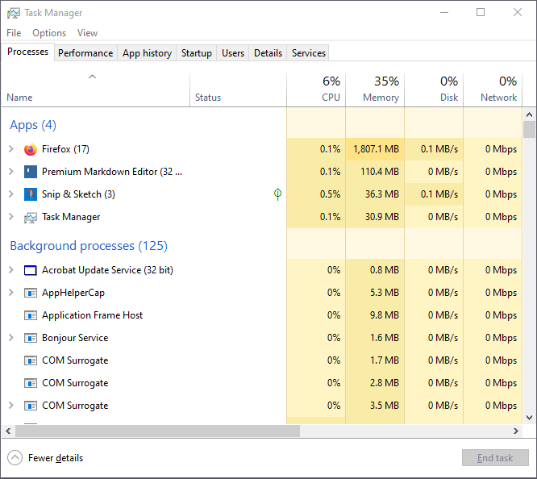

* Click on the Performance tab in the window that pops up.
  This will get us closer to what is needed. The  information
  in the Performance tab will provide us with more
  information about your computer. The information displayed
  will help understand how resources are being used and what
  is available for other processes we may want to run and use.

* Click on the CPU entry, and look to see if
  **Virtualization:  Enabled**. In the example displayed on
  the screen, you can see that virtualization is enabled
  and we can move on.

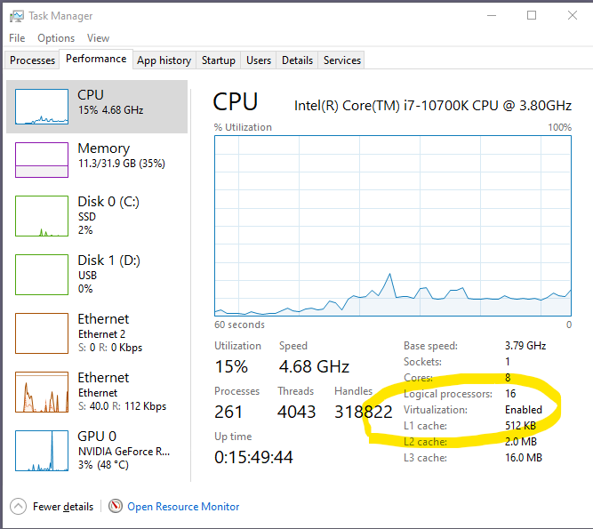

If there is no information, virtualization is not
enabled or is not possible on the computer you are
using. If the results show that virtualization is
disabled, we will need to "flip a flag" to enable
virtualization. The steps below will get you there.

### BIOS Steps for Enabling Hardware Virtualization

Modifications to the **BIOS** can be a bit tricky and
cause some people to cringe a bit in changing these
settings. So, you will need to be careful when
following the steps. There is a usually a way to
recover when modifying the **BIOS**, but since we are
only changing one setting, you should be ok with
this. If not, there is another way given below.

* If your computer is already on, you will need to
  restart the computer. As soon as the machine is
  restarting, start tapping rapidly on the appropriate
  key to enter into the boot menu or **BIOS** setting
  menu. On some computers this will be the ESC-key on
  others it may be F2-key or F4-key depending on the
  maker of the computer. On the authors laptop and
  Desktop, the **BIOS** setting escape key is the 
  **F2-Key**.

* If the **BIOS** settings menu does not show up
  **and** the computer continues to boot up into
  Windows 10 (or Windows 11) repeat the previous step
  until it works or try the next section for a
  different method. Sometimes this just requires typing
  the **ESC-key** even faster.

* Once the **BIOS** menu is on your screen,  locate the
  CPU configuration menu. This will not be the same for
  all computers. So, you may need to click on some menus
  before seeing the correct item in a menu - see the
  description in the next step.

* Next find the setting for Virtualization. This may not
  be in the same location from one computer to the next.
  However, it will be there somewhere on most new
  computers.

* If Hardware Virtualization is disabled, select the
  Option for enabling Hardware Virtualization - usually
  a toggle between disabled and enabled.

* Save the changes that have been made to the **BIOS**
  setting.

* Finally, exit the **BIOS** settings menu. and reboot
  the computer to have the changes take effect.

In some implementations, you can do the save and
exit in one step. When you have clicked on the
"Exit" option or "Save and Exit" option the computer
should boot up in the OS and behave pretty much as
usual. You can check to see if the change worked by
opening the Task Manager again and checking the CPU
performance.

Since this process is carried out before any real
applications are available, there are no pictures in
this case. However, we will see how to get a screen
shot of some of the operations once we have a
virtual machine up an running - more on that a bit
later.

### Enable Hardware Virtualization Directly

For Windows 10 and 11 boxes there is a little easier
way to get into the **BIOS** on your system. If your
computer is running,

* Click on the **Start** menu on your desktop and click
on the Setup icon.

* Click on the "Update & Security" link

* Click on the "Restart now" button in the "Advanced
  restart" are of the dialog that pops up.

At this point the computer should start through a
reboot to the **BIOS** settings menu. From that point on
the steps from the previous method can be used. You
will need to find the virtualization enable/disable
toggle just like before and then "Save and Exit" to
reboot and start working.

### Hardware Virtualization on MacOS

Unless you are extremely unlucky in your MacOS life,
hardware virtualization will be enabled on your
Macintosh/Apple computer.  To see if your Mac is one
of the many that already have hardware
virtualization enabled, do the following.

* Open a terminal by clicking on the terminal app on
  the desktop. Note that on the **Macbook Pro** used by
  the instructor, a link to a terminal appears on
  the Dock (or the Launchpad).

* At the prompt in the command terminal, type  the command

     sysctl -a | grep machdep.cpu.features

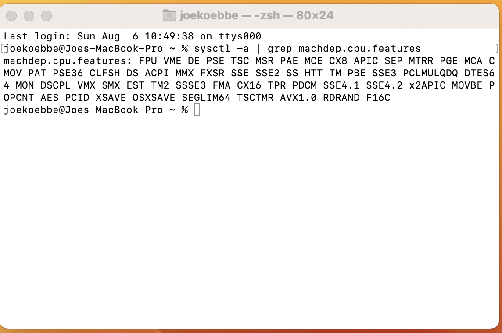

* The output from the previous command should look
  like a rather long list of cryptic characters that
  indicate various states of things on your apple
  computer.
  
If you parse through the  output there is a three
character output, **VMX**. This indicates that
hardware virtualization is available on the Mac
computer being used. If virtualization still needs
to be enabled, you can start with the following
approach.

* To enable hardware virtualization, you should run
  Software Update from Apple. The update may clear
  up a firmware  upgrade for the CPU on our Apple computer.

If this still does not do the trick, see your
instructor to make sure virtualization is enabled
and available for the next content on virtual
computers.

## Virtual Computers for Scientific Computing

In testing ideas in computational science it would be
nice to be able to install a piece of code being tested
onto a completely different computer possibly using a
different OS. In that case, you would
need a computer for editing and maybe compiling the code
and another used as a guinea pig machine (GPM) in case
something goes horribly wrong. The development of projects
using this approach might require repairing your GPM every
time you run into a significant problem. In addition,
purchasing and maintaining two physical computers while
reinstalling an OS multiple times. The time and cost may
be prohibitive in terms of development deadlines and/or
one's bank account for software developers.

Fortunately, hardware virtualization and virtual machines
(VMs) provide a more cost effective means for developers.
The creation of a virtual machine produces a fully
functional computer on top of the existing hardware on
your current physical computer. The resulting VM acts
exactly like a computer off the shell running any OS we want
installed on the VM. This allows developers to work on a
variety of configurations without buying more physical
hardware. This is the idea behind Cloud Computing.

VMs can also be  used to apply virtualization on
hardware like storage devices and networks. For
this course we will be installing software that
will manage VMs that we create. In turn we will
use the VM we create to test ideas related to our
work on scientific computing.

## Examples of Images for VMs

1. Use coding to illustrate the use of VMs. In the introduction to CUDA (need to cite textbook) the comment is made about needing Linux to get the core of CUDA programming. If you are using a Windows machine a VM platform will need to be installed!

### What is a Virtual Machine (VM)?

A VM is basically an application or app that runs
on a computer that thinks it is a fully functioning,
standalone computer that is independent of the physical
computer you work with every day. It is best to
have a few definitions to start. So let's delineate
between the physical and virtual machines we will
create and use for work on problems during the course.

**Definition:** The physical computer will be referred to
as the **host computer** or **host machine** and the default
operating system on the host computer is referred to
as the **host operating system (HOS)**. This will typically
be the operating system that boots up your computer for
your day to day work (Microsoft Windows or Linux).

Any physical computer has resources, like one or more CPUs,
disc drives, memory, cache, and other real parts of the
computer that you can reach, touch, upgrade, replace, and
monitor. The way we use any of the resources on a laptop
or desktop computer is through the OS which is installed
on the computer. Note that the HOS may be Linux, Windows,
or MacOS. Most modern OS's support the use of VMs. What we
need is a way to create VMs. This includes a way to specify
the resources we will need to build a fully functioning
(virtual/fake) computer, develop apps, and use the created
VM to test the work we are doing.

The first step towards successfully deploying a VM is to
install a user interface (UI) that will do a lot of the
work on our behalf.

**Definition:** A Hypervisor is software that can be
installed on a computer to create and manage VMs on a
host computer. A **Type 1 Hypervisor** is installed directly
on the hardware (bare metal hypervisor) of a computer and
in place of the (possibly) existing OS. This is used in
place of the OS on the  physical computer. This type of
Hypervisor allows the hardware to deploy VM's directly.
A **Type 2 Hypervisor** is used to install VM's on top of
the HOS.

The advantage is that you can use a VM to perform tasks
asynchronously from the host computer. Using a Type 1
Hypervisor in an enterprise setting is common in computing.
This allows a "VM on demand" approach to computing
resources people need. If you have an interest in
Information Technology (IT) VM computing is something
you will need to master. Virtual computing resources like
VMware and AWS are examples of publicly available pay as
you go virtual machines that can be used by developers.

Before we build our first VM, we need a couple of things
to be done to be to be able to create a VM.

### Things needed before installation of a Hypervisor

Before the creation of VMs can begin, we will need to
make sure that the physical hardware can handle the
additional workload. When a VM is created, a portion
of the physical hardware must be made available to the
VM for it's dedicated use. This means hardware, storage,
and other resources. One way to ensure that your computer
has enough stuff is to find the information about your
computer as follows:

* Open the Settings window to display the following and
click on the System link.

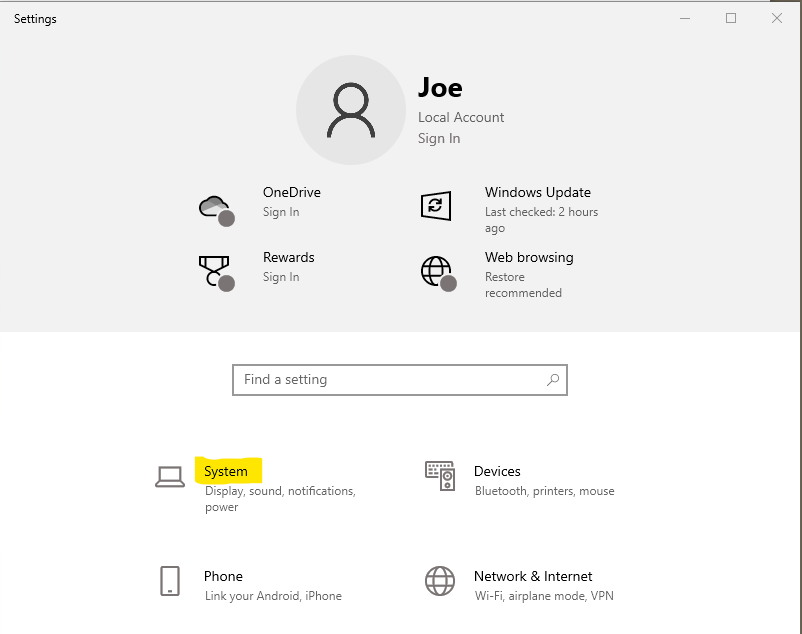

* Next, scroll to the bottom of the links on the left
hand side and and click on the About link as shown
below. The information needed is in the window that
pops up on your screen.

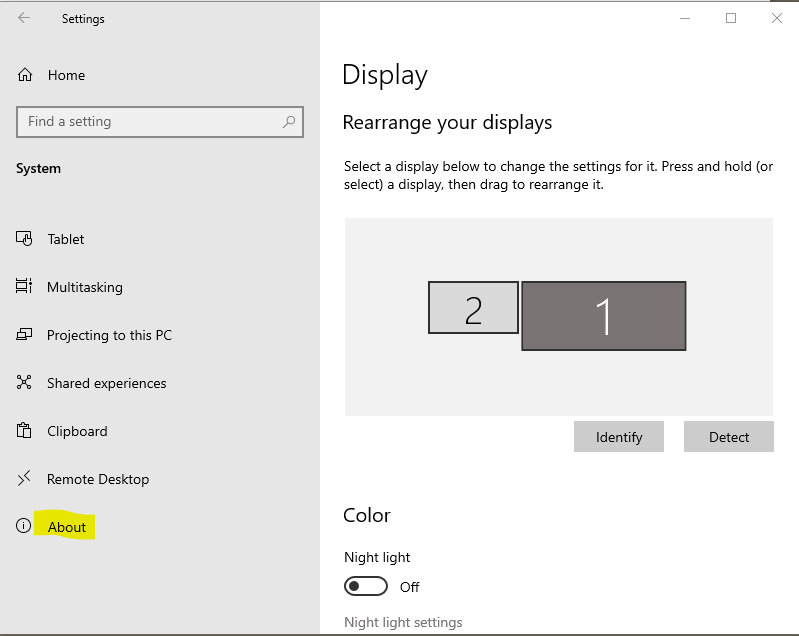

* The OS information (64-bit this computer) and memory
available are both shown in the right hand side container
of the window In this example, the computer has 32BG of
memory. We need to go down a bit more to find out the
number of cores available.

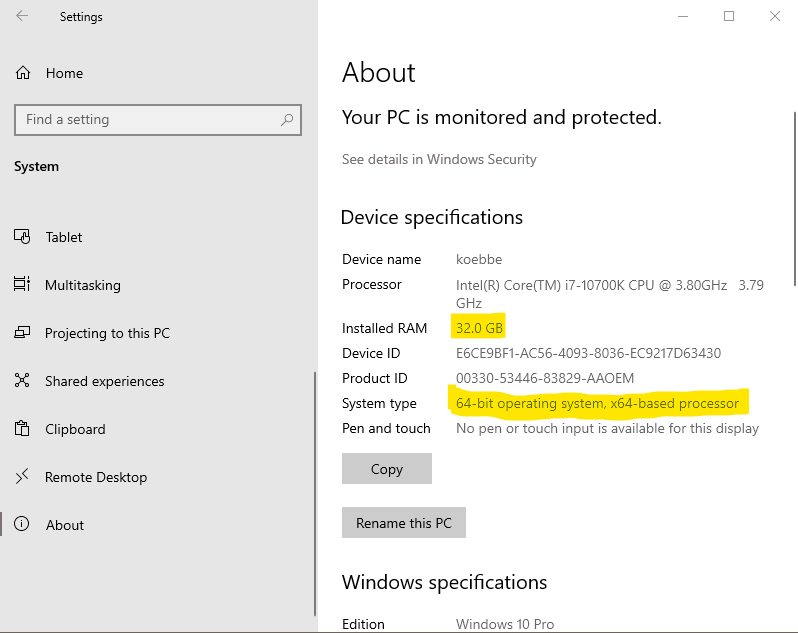

* To figure out the number of cores, you can scroll down
on the right container in the window shown above and open
the device manager by clicking on the link as shown below.

* The device manager will popup. You will need to expand
the list of processors by clicking on the Processor
heading as shown.

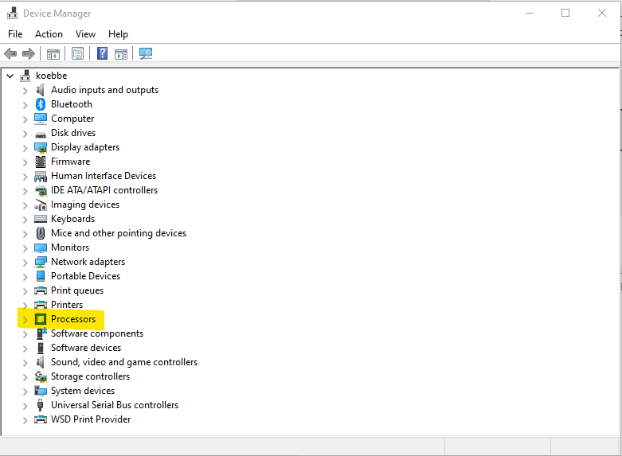

* The final step is to count up the number of cores that
you have available on the computer. The expanded menu in
the Device Manager should look like the following.

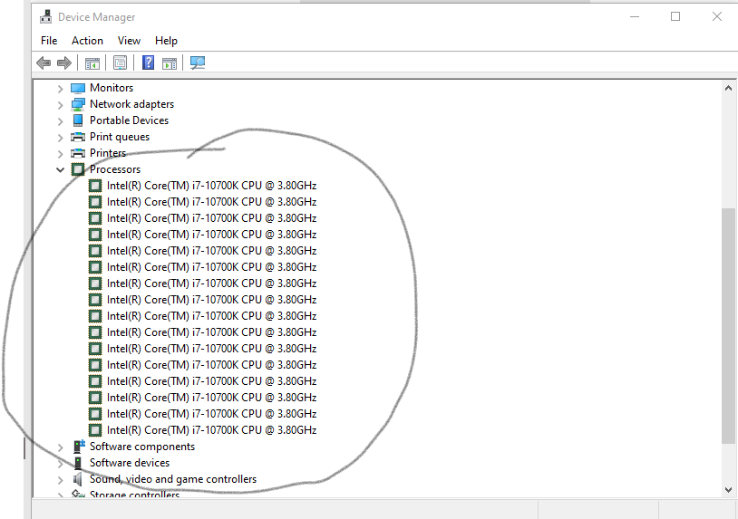

So, it appears that the computer in this example will
have 16 cores. Note that the actual physical number of
cores on the machine is one half the total number

You will need to make sure that your computer supports
digital virtualization and if so, is virtualization enabled
on your computer. If virtualization has not been enabled,
this will need to be done.

Note that it might make sense to build a VM that has
4 cores assigned with 8GB of memory to run a simulation
while you are streaming video or doing other tasks on
the rest of the resources on your computer.

#### Step 0. Enable Hardware Virtualization Support in BIOS

This was done earlier in the
[lesson on virtualization](./content_01/). If the steps
to enable hardware virtualization have not been completed
If you have not completed the steps to enable this feature,
you should go back and do this now. A brief version of the
steps to take care of hardware virtualization issues follows.
If you have completed the steps below, you can skip to the
next section of the lesson.

##### A Brief Review of How to Enable Hardware Virtualization

Note that if you are using on 32 bit apps, the following
steps are not necessary. If you intend to use 64-bit apps
and such you will need to enable virtualization. Most
scientific computing application are run in a 64-bit
setting to guarantee the accuracy of the many, many
calculations needed to approximate the solution of
mathematical problems.

##### The Steps to Enable Virtualization

* Restart your computer.

* Toggle **F2** or the boot escape character to get into
  your computer settings.

* Once in the select boot device pops up, select **Enter Setup**.

* Go to **Advanced Settings**.

* Determine which setting has to do with the
**Intel (VMX) Virtualization Technology** or equivalent for other vendors.

* If disabled, enable.

To finish, restart your computer from the setup menu.

Each of these steps is likely to depend on the computer
vendor who provides the CPU on your computer.

## What are the benefits of using Virtual Machines?

The following examples present a few different situations
where the deployment of a VM or multiple VMs may be helpful.
You can probably think of number of reasons in your
computational experience.

### Learning a new OS

There are a lot of good reasons to learn a new OS. These
may include a job requirement or potential job requirement
or to use in data science applications. It may be the case
that you just want to expand your knowledge base and skill
set. Using VM's allows one to install Windows OS, Linux
varieties like Debian and Ubuntu and any number of variants.
The advantage is that you can create a completely detached
computer from your HOS to learn and work from. If something
goes wrong, you can just stop the VM and start from scratch
with a new VM. Or scuttle what you were doing by deleting or
destroy the VM and build a new VM from the ashes.

### Testing ideas without risking damage to the host system

Developers will eventually run into projects that will require
the use of lots of resources or involve a code that can damage
file systems and such. It makes sense that the testing could
be done asynchronously in a VM without risking your hardware
as you work on problem difficult problems. Think about a mail
handler that could potentially wipe out or corrupt your entire
mail account. Doing so on a live system could be disastrous
for a company or business. Hopefully, a competent IT person
would have the sense to at least make a full verified backup
to restore any lost files. However, using VMs will also help.

### Performing calculations in parallel to host machine activities

If the work you do involves large scale systems and still
need to work on your HOS. Set up a virtual machine to do the
computations behind the scenes. This allows a user to monitor
the progress of simulations and still complete other work
with dedicated resources. Another application may just need
the ability to submit jobs to a High Performance Computing
(HPC) center that allows access through submission of jobs to
a queue. You might consider using a VM to monitor the
simulations as they run.

### What is the down side of working on a VM?

Splitting resources can cause issues. Memory and
processors must be allocated and that comes out of
physical memory and disk space. VM resources are
not available once the VM gets going. To keep your
work going on a VM, you will need to put save the
configuration before shutting down your computer.
If the configuration of the machine is not saved
you may lose work. The nice thing is that most
Type 2 Hypervisors will have management tools to take
care of these issues.

## Step by Step VMs

The following steps can be used to generate a VM:

### Assumptions

The steps given make the following assumptions:

* We will start with a Windows OS - in particular the HOS will be Windows 10 or 
Windows 11.

* The Hypervisor in the example is VirtualBox - this is freely available from
Oracle.

* The example will create a VM running Ubuntu Linux - Ubuntu  will be used
throughout the course to develop  applications for solving
problems in computational science.

### Step 1: Install A Hypervisor

Since free is better than not free, this course will
focus on Virtual Box by Oracle. Most software on the
internet comes with some work of set up file. Virtual
Box is no different. Open your favorite browser and
navigate to Oracle's download page for Virtual Box.
Note that VirtualBox is a Type-2 Hypervisor. This
matches what we would like to do.

To get a copy of VirtualBox, visit the following site.

[Virtual Box Download](https://www.virtualbox.org/wiki/Downloads)

Click on the link to the appropriate host. In the
case of this example, that will be Windows hosts.
This will download an executable setup application.
Click on the setup file. Note that if you using a
MacOS on your computer, the appropriate type
is macOS/Intel hosts. A screen shot of the two host
types circled is shown below.

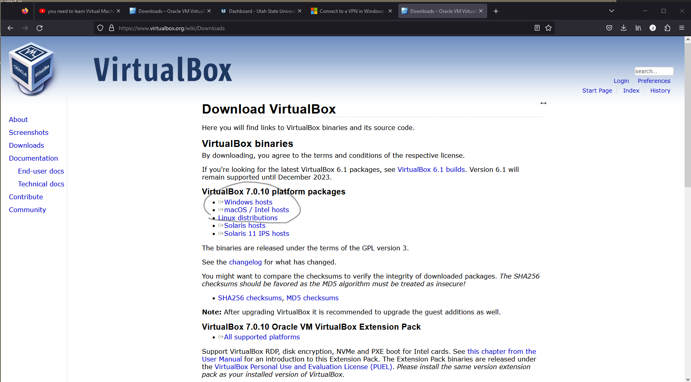

You will need this to download the software.

### Step 2: Install the Software

After the download of the setup.exe file is complete,
you can click on the executable in your downloads or
make a copy on your desktop. Once the setup.exe is
running you will asked if you want to let the software
change your system. Click on the Yes button to keep
going with the installation. The installation is like
a lot of other installations on Windows. You can
basically click on the Next link a few times and the
installation will proceed with little in the way of
issues. When al is well and done, there is one additional step.

### Step 3: Install the Extension Pack for the Software

There is an extension pack that you will need to install.
If you back to the main
[download site](https://www.virtualbox.org/wiki/Downloads)
and scroll down until you find the header

    Virtual x.x.x Oracle VM VirtualBox Extension Pack

and then click on the link just below the header. This
is needed to add some more functionality to the virtual
machines being created. Once the extension pack has been
downloaded, start up the application to see the following
window.

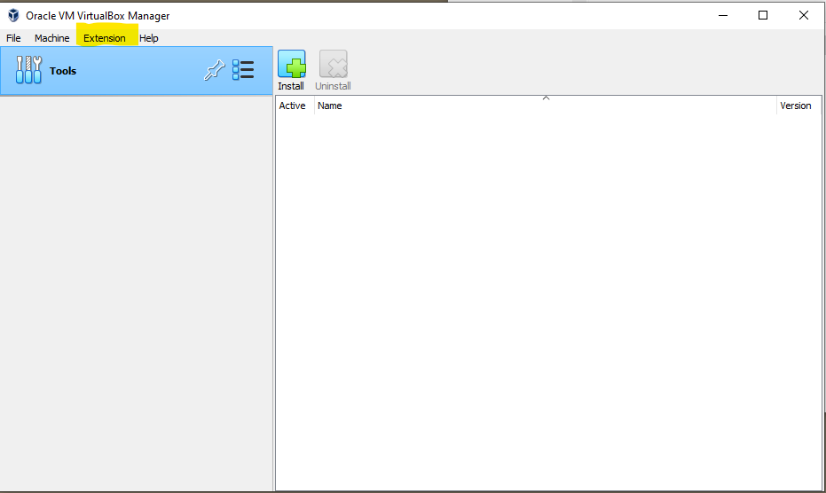

Click on the Extension menu item that appears in the
VirtualBox User Interface (UI). The result will be a
menu of choices to install or uninstall extension packs.

The work to install the needed extension pack execute
with little fan fare. When the installation of the
extension pack, the extension pack will be in a list
of things that are included. To see this, click on the
menu of tools in the UI (see the figure below).

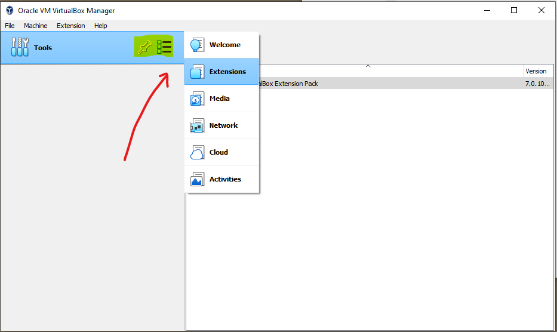

We will need to do a bit more work to get a VM running.

### Step 4. Getting the OS that we want

We will want to install some OS to run the VM. In this
example, the choice of operating system will be publicly
available Ubuntu Linux. To do this we will download a file
for some version of Ubuntu Linux. The link used to get the
file is the following:

[Ubuntu Downloads](https://ubuntu.com/download/desktop)

Scroll down to a point where the download link to Download
xx.xx.x. In our example, the version downloaded is 22.04.3.
Note that the download file is large and will take a bit of
time to download. If you are worried about the file
downloaded, there is a checksum you can run. As a lesson
in how to do computer modifications we will see how to do
the checksum.

Once the download starts the browser will display a thank
you page with check sum instruction. Click on the
"verify your download" as shown below.

To test, the command listed above can be entered into a
terminal in the folder where the file is located. You won't
know how to get to the terminal until a later lesson. However,
if the terminal is up and running, the result of the command
is shown in the following figure.

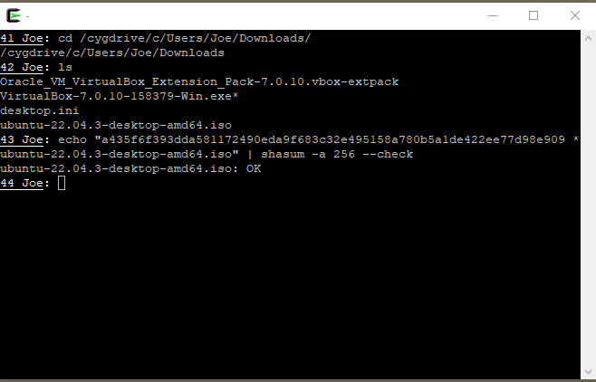

The output from the command indicates that the check sum is
correct and the file is most likely ok. The last piece of this
part of the process is to locate the file somewhere that is
easy to find. In our case, the location will be in a folder
on my Desktop.

### Step 5: Building a first VM Running Ubuntu

Everything we need is now in place. Start the VirtualBox app
by any of a number of ways. Start up the VirtualBox app. You
should see a window like the following.

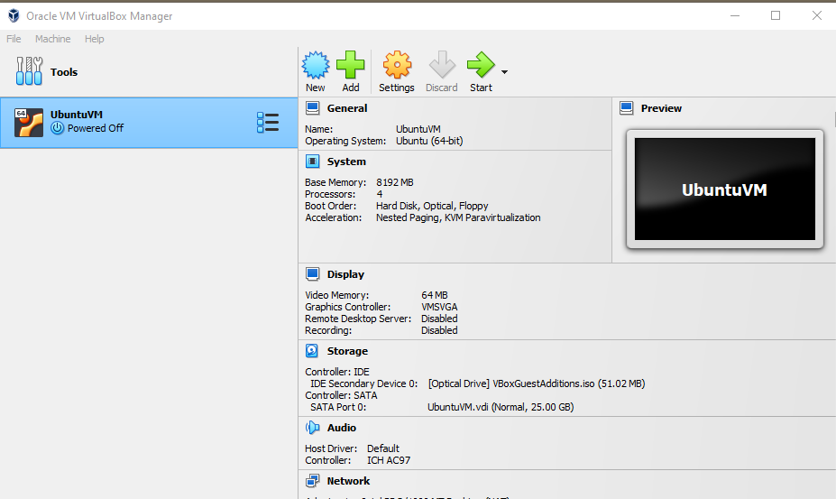

Next, click on the New button in the Tools bar. This is
where the work starts in putting together a description
of the VM. The result should look like the following.

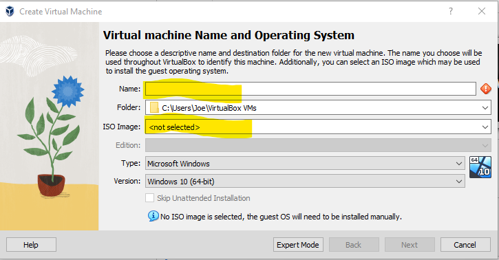

You will need to fill in the name of the machine you are creating. For example,

ubuntunow

might work for the name. You do not need to pick the default
folder where the VM details will be stored. You will need to
set the ISO image to the location of the file downloaded above, say

.../Desktop/Ubuntu22.04.3_dist/ubuntu-22.04.3-desktop-amd64.iso

Mostly, you can use the drop down arrow to locate the
appropriate file. Now, click on the Next button to move on.

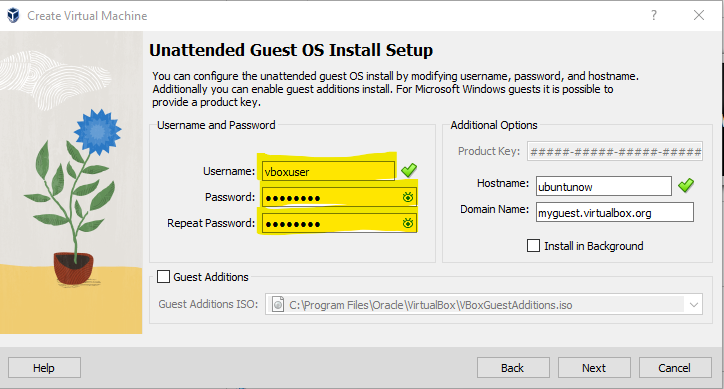

**Note:** If you leave the username as is, VirtualBox will
use the username, but require administrative privilege to
login. It is suggested that when building a VM set a different
username. Use a lower case letter to start your username.
Otherwise, the setup will throw an error at you. Also, you
should click the Guest Additions to make the installation
work a bit better. Click the Next button to continue.

[Virtual Hardware Choices](../images/memory_storage_amounts.png)

In the Hardware section above you will need to select the
amount of memory and number of CPUs. This will depend on the
machine you are using. On the machine used in this lesson,
the total number of CPUs is 16. So, it would make sense to use
4 CPUs and for the 32GB of memory on the physical computer, it
might make sense to use a setting like 8GB. Then click on Next
to move on.

For a first VM, just click on the Next button on the window
above to set up the 25GB of storage. A summary of the VM
resources will then appear

Clicking on the Finish button will create the VM. The whole
process will rule in a popup that looks like the following.
A VM should appear in the VirtualBox manager. From there,
you can start and stop the VM and do a lot more. You should
spend some time getting familiarized with the commands
and features.

### Some issues that may occur

The following are a few things to look at when completing
this module.

### Long Installation Time

Installation: When you have everything set up and have
clicked on the Finish button, it will take a bit of time
(under 30 minutes, but more than 10 seconds) to install
the software and create the VM. You should actually let
things go at this point. In addition, the VM will also go
through a reboot to get all of the features updated and
the like.

### Username Issues

In the installation process you will be asked to choose
a user name. VirtualBox will balk if the first character
in the password is not a lower case letter - not sure why,
but this is the case. So, use "joe" and not "Joe" for a
user name.

### Need to Install Software on Linux

The version of Linux or Windows you make available to the
VMs you create will only have basic routines. Depending on
what you are used to you may need to use package management
softare like **pip** or **apt** to install software you want
to use. For example, if you make the **.iso** file for
**Ubuntu Linux** available and you want to work with **tcsh**
instead of **bash** you may need to install **tcsh**.

### Black Screen on restart of the VM

You will need to increase the VM memory allocation.

    * Power off the currently running VM using the x in the
      top right corner of the window.

    * When the VM Manager displays, right click on the
      VM that was just powered down.

    * Click on the Settings menus item

    * The settings window will pop up and you will need to click
      on the Display menu item.

    * This will popup a window that will allow you to set
      values for the memory and monitor preferences.

    * You should adjust the Video Memory up; say to more than 50MB.
     
    * Click on OK

    * Start the VM to running again.

This worked for me. There is a reference to a YouTube
video I found  that corrected this problem.

---

## Module Review Questions

---

**Review Question 1** Suppose you are running a Windows machine,
but you have a program that needs to run in a Linux environment.
How can you run the program while still technically using your
Windows machine?

**Review Question 2** What is the difference between a native and
a hosted virtual machine monitor (hypervisor)?

**Review Question 3** What is the difference between a virtual machine
and a virtual appliance?

**Review Question 4** What are the associated benefits of using
virtualization software? Give a few examples of each benefit.

**Review Question 5** What is the difference between native and
hosted virtual machine monitors?

**Review Question 6**  What are the three components of virtual
machines?

**Review Question 7** What is the main purpose of virtual machines?

**Review Question 8** What creates virtual machines?

**Review Question 9** What are the benefits of using virtual machine?

**Review Question 10** Do virtual machines have different IP addresses?

**Review Question 11** What are the disadvantages of using a virtual machine?

**Review Question 12** What controls a virtual machine?

**Review Question 13** What are the pros and cons of virtual machines?

**Review Question 14** How safe are virtual machines?

---

## Module Questions

**Question 1** Verify that the computer you are
using for the class is able to handle hardware
virtualization. Along with the apps/commands needed
to determine whether or not hardware virtualization
is enabled, include a screenshot that shows the
computer is hardware virtualization enabled. Use
something like Snip&Sketch or the equivalent Apple
screen shot app.

**Question 2** Read the article at the link:

[Cloud Computing](https://aws.amazon.com/what-is/virtualization)

and write a few sentences about the downside of
running virtual  computers on your laptop or
desktop. Do not use ChatGPT or other AI application.
After writing your answer to this question,  run a
request into ChatGPT to see what the bot finds.
Compare your answer to the response from ChatGPT.

**Question 3** Provide a screen shot of the
resources available on your physical computer. How
many cores, speed, and so on. You can find the
information in the About tab in the Updates and
Security section on the computer. Use a screen shot
of the popup window.

**Question 4** What are the benefits of
virtualization, and what is one situation where you
would want to use a VM instead of a physical machine?

**Question 5** What is the difference between a
native system virtual machine and a hosted system
virtual machine?

**Question 6** What are 2 operational benefits of
virtualization?

**Question 7** What is the aim of a Virtual
Appliance?

**Question 8** What is a virtual appliance and why
would it be desirable over running services directly
in your host operating system?

**Question 9** What are 2 benefits of Virtualization?

**Question 10** What is the advantage to using
virtual appliances on servers to serve different
functions rather than simply installing the
processes on the machine?

**Question 11** What are the benefits of using
virtualization software?

**Question 12**  What are the three main types of
virtualization?

**Question 13** What you should know about
virtualization?

**Question 14** What is the weakness of
virtualization?

**Question 15** What are the six areas of
virtualization?

**Question 16** What is the biggest challenge in
virtualization?

**Question 17** What is the risk of using
virtualization?

**Question 18** What is the strongest security feature of virtualization?

---

## The Main Question for Math 4610 at USU

---

**One Question:** Use the instructions in the
module to install Virtual Boxfrom Oracle. Once
you have the software installed create a VM and
also use the interface to create a clone/copy
of the virtual machine. Use the interface to
determine the IP information for all three
computers. That is, (a) the host computer, (b)
the first VM and (c) the clone. Write out a
brief description of the process by describing the
installation, problems encountered and so on. Make
sure you have the resources for creating each VM
separately. If you have the resources to do all
of the work - great! As a second best result, run
each machine separately and get the needed
information.

---

## Software for Hypervisor Installation

The following represent examples of hypervisor vendors/providers
that can be tapped for virtual machines.

### Free VM Managers

* [Oracle VirtualBox](https://www.virtualbox.org)

### Commercial VM Managers

* [VMWare](https://www.vmware.com)

* [Azure](https://azure.microsoft.com)

## Terms To Know

* **virtual machine (VM)**
* **hypervisor**
* **type 1 hypervisor**
* **bare-metal hypervisor**
* **type 2 hypervisor**
* **host computer**
* **physical computer**
* **guest machine**
* **host operating system**
* **guest operating system**

## Module References

* [Microsoft Azure](https://azure.microsoft.com/en-us)
* [NetworkChuck Youtube Video](https://www.youtube.com/watch?v=wX75Z-4MEoM)
* [Oracle VirtualBox](https://www.virtualbox.org/)
* [How to enable Intes VT-x virtualization feature in Max computer](https://kb.parallels.com/en/5653)
* [Oracle](www.oracle.com)
* [Cloud Computing](https://aws.amazon.com/what-is/virtualization)
* [Lehigh CSE Sys-Admin Questions](https://www.cse.lehigh.edu/~brian/course/2012/sysadmin/sample-exam3-questions.html)
* [Wikipedia Page](https://en.wikipedia.org/w/index.php?title=Virtualization&oldid=1213873557)
* [How to use VirtualBox Tutorial for Beginners](https://www.youtube.com/watch?v=nvdnQX9UkMY)
* [How to run an Ubuntu Desktop virtual machine using VirtualBox 7](https:/ubuntu.com/tutorials)
* [Black Screen Issue](https://www.youtube.com/watch?v=57U2sTzlfuM)
* [Lehigh CSE Sys-Admin Questions](https://www.cse.lehigh.edu/~brian/course/2012/sysadmin/sample-exam3-questions.html)
* [box](https://www.box.com/home)