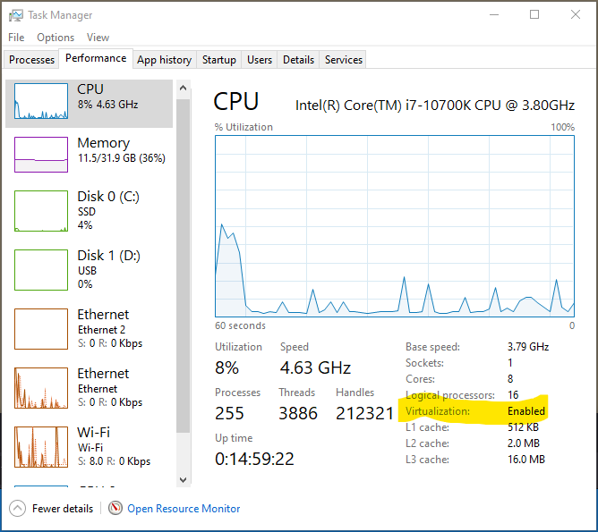

# Homework Solutions:

For the course, an example solution is being included. The solutions in some cases may include alternate information and still be correct. So, you should take into account that any solutions provided may be slightly different than yours.

### Virtualization Questions:

##### Question 1 Solution:

**Question 1** Verify that the computer you are using for the class is able to handle hardware virtualization. Along with the apps/commands needed to determine whether or not hardware virtualization is enabled, include a screenshot that shows the computer is hardware virtualization enabled. Use something like Snip&Sketch or the equivalent Apple screen shot app.

**Solution 1:** The information we need to answer this question can be obtained by following the instructions in the lesson. To determine if virtualization is enabled, I opened the Task Manager using "Ctrl-Alt-Del" on the keyboard. Then, clicking on the Performance Tab and the following will appear.

This shows that the desktop Ii am using is "virtualization enabled". Note that the image showing the result desired was created using the Windows utility, "Snip&Sketch". This produces a .png or portable network graphics formatted file.