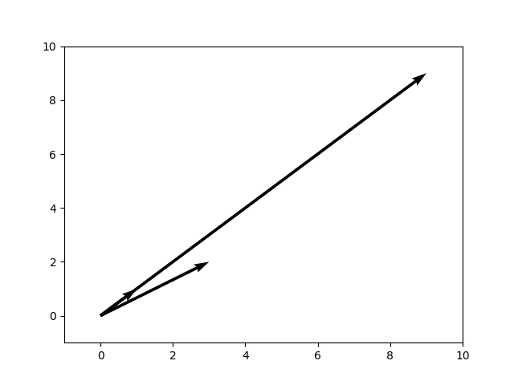

# Module 02: Coding Linear Algebra Operations for Matrix Multiplication

All practitioners of computational mathematics or
scientific computing should understand and/or
effectively use linear algebra in problem solving.
The algorithms for linear algebra are essential for
many, if not all simulation (e.g, the 7-day forcast
on your local 10:00 news broadcast) efforts using a
computer, operating system, and development platform
(e.g, VSCode, Matlab, Mathematica, etc.)

* [Module Vocabulary](./content_02.md#mathematical-terms-and-notation)

* [Module Exercises](./content_02.md#module-exercises)

* [Module References](./content_02.md#module-references)

## Introduction

In this module, we will consider a single
fundamental linear algebra operation important in
most computational problems - namely,
**matrix multiplication**. The operation of
matrix multiplication is used in most algoritms
performed by/on computers. In a basic linear algebra
course, matrix multiplication is usually introduced
using small matrices that keeps the amount
computation by hand reasonable. We will consider a
couple examples to sweep out the linear algebra
cobwebs that students may have on matrix and vector
products. The main goal of this module is to write an
efficient code for multiplying two large matrices
together.

Let's start with a simple definition of the term,
**matrix**. For our purposes the following definition
will work.

**Definition:** A **matrix** is a rectangular array
of numbers.

Any matrix is completely characterized by
the number of **rows** and **columns** in the
rectangular array along with the numbers in
the matrix. The numerical values in a matrix or
array are usually dictated by an application or
purpose for using a specific size of matrix.
In a more general setting the idea of a
matrix would involve a rectangular array
of objects - for example images or references
pointers to images in an array on a screen
can be thought of as a matrix of images.

For our needs, the objects in a matrix in this
module are relatively simple - we just need a
way to keep track of numerical values in our
rectangular array.

**Example:** The rectangular array
$$
  A = \left[
         \begin{array}{rrrrr}
           1 & 2 & 3 & 0 & -1 \\
           4 & 5 & 6 & 5 & 3 \\
           7 & 8 & 9 & 2 & 3 \\
           10 & 11 & 12 & -3 & 6
         \end{array}
      \right]
$$
is a $4\times 5$ matrix due to the $4$ **rows**
and the $5$ **columns** in the array. In this
example, we need a total of
$$
  m \times n = 4 \times 5 = 20
$$
real numbers to completely define a specific
rectangular array with $m=4$ and $n=5$.

**Note:** The matrix in our example could be
thought of as a matrix of integers based on the
fact that each number in our array is, in fact,
an integer. However, our focus in this module will
be on matrices with real numbers as **entries**.

**Notation:** In general, we say the matrix $A$ is
an $m\times n$ matrix or
$$
  A \in \mathbb{R}^{m\times n}
$$
read as "The matrix, $A$, is an element of the set
of all $m\times n$ of matrices with real numbers in
the elements entries of the matrix".

**Example: (cont.)** Using the example above, we
can write
$$
  A \in \mathbb{R}^{m\times n} = \mathbb{R}^{4\times 5}
$$
to indicate the number of rows and the number of
columns.

**Note:** The number of rows, by convention given,
is first and the number of columns is given after
the number of rows. This is a convention adopted
from matrices as used in the solution of linear
systems of equations.

One might ask the question: "Why the extra notation
for a set of matrices?" What a software engineer
wants to be able to do is to write software that can
be used on lots and lots of inputs (e.g. matrices).
That is, be able to use a "write once, use many times"
software development approach. So having a general
definition of the all possible inputs (e.g, matrices)
will help us write a single code for multiplying
general matrices with real number entries.

**Definition:** Suppose that $A\in\mathbb{R}^{m\times n}$.
Then we can refer to a single **entry** or
**element** in a matrix as follows.
$$
  (A)_{i,j} = a_{i,j}
$$
for $i=1,2,\ldots,m$ and $j=1,2,\ldots,n$. The
valu of the first subscript, $i$, will always
refer to the row of the entry and the second
subscript, $j$, will always refers to column
of the entry. To distiniguish between the matrix,
$A$, and the entries of the matrix, $(A)_{i,j}$
it is common to denote an entry using a lower
case letter, $a_{i,j}$.

**Example: (cont.)** The entry in the $i=2$ and $j=5$
location  in the matrix is
$$
  (A)_{i,j} = (A)_{2,5} = a_{2,5} = 3
$$
and for $i=3$ and $j=4$,
$$
  (A)_{i,j} = (A)_{3,4} = a_{3,4} = 2
$$
This should be enough on how to address entries
in a general matrix and how to write a code that
performs matrix operations like addition and 
multiplication.

**Note:** The $(\ )$ around the matrix $A$ actually
can be thought of as an operation on the matrix.
Also, there is no location $i=3$ and $j=12$ since there
are only $5$ columns in the matrix. The same is true for
$i=-3$ and $j=1$. So the values of the indices are
bounded by $i=1,2,\ldots m$ for the rows and by
$j=1,2,\ldots,n$ for the columns.

We will always order our columns from left to right with
the first column being associated with $j=1$. The
analogous statement can be for the rows of a matrix on
the index $i$. This will give us a consistent way to
define matrices and the products of matrices.

In many computing languages (C,C++,Java, etc.) we
can use a notation like
$$
  (A)_{i,j} = A[i][j]=a[i][j]
$$
to extract or reference entries in matrics or
(Fortran, Mathematica, Matlab, etc.)
$$
  (A)_{i,j} = A(i,j) = a(i,j)
$$
which means we need to be a bit careful in
translation of linear algebra algorithms into
computer code. What a good software engineer
should be able to do is write a **pseudo-code**
for matrix multiplication and then write a
version for a coding language from the
**pseudo-code**.

### Caveats about Coding

If all we needed to do is compute products
for small matrices, this particular module
would not likely be very helpful. However,
in most applications the use of "very large"
matrix multiplication becomes necessary and
would be intractable to do by hand. For example,
in modeling blood flow in a persons brain, it
may require the use of very large matrices to
resolve measurements by doctors/researchers. The
algorithms used to do the modeling may require the
multiplication of matrices of that have millions
of rows and millions of columns.

Even our first example of a $4\times 5$ matrix with
all the numerical values will require some level of
tedious work no matter what we do. Basically, there
will be a lot of arithmetic to perform. The
arithmetic is not difficult. However, it is easy to
make small errors that lead to more problems.
Computers are great at repetitious work and a
computer will do the calculations flawlessly up to
the numerical precision of the computer being used.

## Products and the Dot Product of Vectors

As a starting point for the work in this module, the
concept of an **inner product** or **dot product**
arises as a means of defining a product of rows and
vectors in the product of matrices. The dot product
serves as a basic kernel in the multiplication of
any two matrices. To define the product we will
need a couple of arithmetic operations that are
even more important. These are:

* Scalar multiplication or multiplication of two
numbers. This sort of operation takes as input two
real numbers and produces a single real number.
This may seem trivial. However, multiplication of
numbers can be fraught with problems due to number
representation on computers.

* Multiplcation of a number and a vector - can be
thought of as vector scaling. We will need a
definition of a general **vector** to be able to
define any type of operation we are working towards
in linear algebra.

* The dot or inner product of two **vectors**.

These will get the work to a point where the
matrix-matrix product can be defined, coded into a
computer programming language, and made available
to use!

### Multiplication of Scalars

For completeness in notation, the scalar
multiplication of two numbers is included as a part
of the hierarchy of products. We will need to be
careful due to errors in the representation of the
numbers being used and **round off** error. We will
cover this in a future module.

**Definition:** A product of two numbers is just the
number obtained by multyplying the two numbers
together. Symbolicly we write
$$
  c = a \cdot b
$$
for the product, where the value of $c$ requires the
two numbers, $a$ and $b$, and the definition of
multiplication of the numbers (yes, there is more than
one way).

**Example:** Simple Multiplication

If we assume we have a couple of real numbers like
$$
  a = - 3, \ \ \ \ b = 4
$$
Then $c=a\cdot b=(-3)(4) = -12$. One example should
be more than enough of a review.

You might consider the idea of the multiplying two
numbers together as too easy to include here.
However, if you have become dependent on
calculators, you should know that the most basic
kernel of any type of matrix multiplication is the
product of two numbers and this is important to get
correct in the programming you will be doing.

**Note:** This module will go no further into the
details of products of numbers or algebraic
structures. We will assume that the product of any
two real numbers exists and the result will always
be a real number. For doing any work in this module,
the basic idea is that if you need it, pull out your
calculator to do these simple computations.

**Note:** There are multiple ways to define products
of matrices for various reasons. There will be a
couple homework problems to define one or two of
these different, but important products. The main
operation we will work towards is a standard matrix
multiplication defined in all linear algebra
textbooks.

**Note:** Another issue that arises in computations
of products is **finite precision of aritmetic** in
a computer. There is always error in "computer"
numbers and arithmetic applied to approximate values.
As mentioned we will address **roundoff error** and
**finite precision of arithmetic** in a future module.

### A Product of Real Numbers into Vectors

In this section of the module, let's start with the
definition of **vector**. We will give a definition
that will aid in the solution of mathematical problems.
There are a number of ways of determining an abstract
definition of the concept of a vector. One such
definition involves no numbers and can be applied to
many types of objects of the same type. For the
purposes of the work in this module, the following
general definition will suffice.

**Definition:** A vector is an object that has both
magnitude and direction. (see:
["Despicable Me", the movie](https://www.youtube.com/watch?v=A05n32Bl0aY) )

We will use this notion of **vector** as a starting
point for establishing how to represent vectors. There
are a number of ways vectors can be represented.
There are also a number of equivalences that will tie
some of the concepts about vectors to other mathematical
concepts and problem solutions.

As a starting point for representation of vectors,
we can consider a map of some region. Note that this
is what the famous mathematician
[Descartes](https://en.wikipedia.org/w/index.php?title=Ren%C3%A9_Descartes&oldid=1232308031)
used to establish locations of points on maps.
It is said that the profound moment of discovery
for Descartes occured as he watched a fly move
around on the ceiling of a room.

**Note:** Descartes represented the ceiling as a
plane with two independent numbers used to represent
the unique location of the fly on the ceiling (or
wall) as a function of time.

Mathematically, we can always find a unique
representation of a point in a two dimensional
$x-y$ plane using just two numbers. In a Cartesion
plane, the first number indicates a distance away
from an **origin** established by an observer.

We will use a notation delineated by $($ and $)$
to characterize a point in the plane. It should be
noted that this representation of points in the
plane is unique. Since a vector does not include
any fixed location in its definition, a vector as
an object, can be placed in any position we want.
Points are restricted by specifying a reference
point say the origin $(x,y)=(0,0)$. All other
points are determined by how far the point is
from the specified by the origin.

### Consistent Notation for Vectors

Since one of our goals in this module is to write
consistent reusable code for applications that can
find and process data we would like to have a unique
representation for all of our work. This will
guarantee that the data needed is accessible and is
easily referenced in a systematic way for our
algorithms and output created.

**Notation** As mentioned, there are a number of ways to
represent vectors. In this module, a vector will be defined
when delimited in square brackets, $[$ and $]$.

So, we can write a general vector, $\vec{v}$, as
$$
  \vec{v} = \left[
              \begin{array}{r}
                v_1 \\
                v_2
              \end{array}
            \right]
$$
where $v_1$ and $v_2$ are both real numbers. This is
a particular example of a vector with two real-valued
entries.

The same information could be stored as
$$
  \vec{v} = [ v_1, v_2 ]
$$
In the parlance of computational linear algebra the
first representation is called a **column vector**
and the second representation is referred to as a
**row vector**. Per mathematical convention, the
term **vector** will usually be associated with to
a column vector. This assumption will fit well
within many linear algebra concepts. For example,
in the solution of **linear systems of equations**,
th solution vector is typically defined in terms of a
column of values which is a column vector.

Here are a few examples of vectors of the form given
above.

**Examples:** Consider the following expressions for
two component vectors.
$$
  \vec{v} = \left[
              \begin{array}{r}
                1 \\
                1
              \end{array}
            \right]
$$
$$
  \vec{u} = \left[
              \begin{array}{r}
                1 \\
               -7
              \end{array}
            \right]
$$
It is easy to see that the expressions are determined
by two real numbers.

### General Vectors with Real Number Components

In general, we will work with vectors with an
arbitrary number of entries or components. This
means that vectors can be written in the following
way.
$$
  \vec{v} = \left[
              \begin{array}{c}
                 v_1 \\
                 v_2 \\
                 \vdots \\
                 v_m
              \end{array}
            \right]
$$
This is as general a definition as we will need in this
module.

**Note:** If $m=1$ we have a vector that has only
one component. This is equivalent to the set of all
real numbers, since we could write
$$
  \vec{v} = \left[
              \begin{array}{c}
                 v_1
              \end{array}
            \right]
$$
with $v_1\in\mathbb{R}^1$. This looks like a real
number with a bit more complicated notation than
writing the object as a single number.

If $m=2$, the number of components will be two. These
are completely different animals.

### Graphical Representation

It is very easy to visualize vectors with two components.
The following section presents an example.

**Note:** In the graphical representation of vectors,
they will appear as arrows with a starting point, with
a line and arrow head indicating the direction the
vector points. The arrow can be moved to any point as
long as the resulting arrow is parallel to the original.



**Note:** The graphical representation of a vector is
**not** unique. Vectors allow us the mathematical
ability to apply forces at arbtrary points in a
plane.

**Note:** The Python code used to generate the figure
above is located at the following link.

[code](../src/vector_illustration.py)

There is a not so subtle reference to a graphical
description of vectors as arrows in Matplotlib that
uses a quiver to keep track of the arrors being
visualized.

### Vector Operations

Vectors would not be worth much unless we can
manipulate them to solve real mathematical problems.
The following is a brief review of vector operations
including the addition of vectors, scalar
multiplication of a number and a vector.

It should be noted that there are many possible ways
to define the operations for vectors. We will use a
standard definition for these operations. In the
parlance of linear algebra, the definitions we will
use for the operations result in the sets of vectors
being part of a **vector space**. This is important
both mathematically and computationally.

#### Equality of Vectors

In most areas of mathematics, the idea of equality
is important for setting up and solving equations.
We use expressions like $x+12=7$ that can be used
to find a value for $x$ that makes the equation
true. In this simple case, $x=-5$ will work.

**Definition** Supose two vectors
$$
  \vec{v} = \left[
              \begin{array}{c}
                 v_1 \\
                 v_2 \\
                 \vdots \\
                 v_m
              \end{array}
            \right]
$$
and
$$
  \vec{u} = \left[
              \begin{array}{c}
                 u_1 \\
                 u_2 \\
                 \vdots \\
                 u_m
              \end{array}
            \right]
$$
are two general vectors with the same number of components,
$m$. The vectors are equal if and only if all components
are equal. That is,
$$
  u_k = v_k
$$
for all values of $k=1,2,3,\ldots, m$.

**Example:** In this example consider the vectors
$$
  \vec{u} = \left[
              \begin{array}{c}
                1.2 \\
               -3.4 \\
                5.6
              \end{array}
            \right]
$$
and
$$
  \vec{v} = \left[
              \begin{array}{c}
                \frac{12}{10} \\
                  \ \\
                x - 0.78 \\
                  \ \\
                \frac{9.1}{y}
              \end{array}
            \right]
$$
Then, $\vec{u}=\vec{v}$ if and only if
$$
  1.2 = \frac{12}{10}
$$
and
$$
  -3.4 = x - 0.78
$$
and
$$
  5.6 = \frac{9.1}{y}
$$
The first equation is satisfied, so the first
components are equal and the second and third
components can be computed as $x=-2.628$ and
$y=1.625$ to guarantee equality of the components
and thus the vectors.

**Note:** It should be clear to the reader, that the
definition of equality requires that the two vectors
being compared must have the same number of entries.
You can't compare nothing to something in components
that do not exist.

#### Vector Addition

Vector addition is defined by component-wise addition. In
the general vector case, if
$$
  \vec{u} = \left[
              \begin{array}{c}
                u_1 \\
                u_2 \\
                \vdots \\
                u_m
              \end{array}
            \right]
$$
and
$$
  \vec{v} = \left[
              \begin{array}{c}
                v_1 \\
                v_2 \\
                \vdots \\
                v_m
              \end{array}
            \right]
$$
we will define the addition of these two vectors as follows.
$$
\vec{w} = \vec{u} + \vec{v}
        = \left[
            \begin{array}{c}
              u_1 \\
              u_2 \\
              \vdots \\
              u_m
            \end{array}
          \right]
        + \left[
            \begin{array}{c}
              v_1 \\
              v_2 \\
              \vdots \\
              v_m
            \end{array}
          \right]
        = \left[
            \begin{array}{c}
              u_1 + v_1 \\
              u_2 + v_2 \\
              \vdots \\
              u_m + v_m
            \end{array}
          \right]
$$

The addition operation computes a sum by grabbing
two corresponding components, adds these two
components using the addition of two real numbers and
puts this value in the corresponding location in the
resulting vector. Note that this definition produces
a vector. So, vector addition requires the input of
two vectors and output of a third (new) vector,
all of the same size.

#### Examples of Vector Addition

**Example:** Suppose we work in vectors with two components. Let
$$
  \vec{u} = \left[
              \begin{array}{r}
                -2 \\
                 3
              \end{array}
            \right]
$$
and
$$
  \vec{v} = \left[
              \begin{array}{r}
                 1 \\
                 3
              \end{array}
            \right]
$$
Then the vector sum is given by
$$
  \vec{u} + \vec{v} =\left[
              \begin{array}{r}
                -2 \\
                 3
              \end{array}
            \right] +
            \left[
              \begin{array}{r}
                 1 \\
                 3
              \end{array}
            \right]
      = \left[
              \begin{array}{r}
                (-2) + 1 \\
                 3 + 3
              \end{array}
            \right]
      = \left[
              \begin{array}{r}
                -1 \\
                 6
              \end{array}
        \right]
$$
The output for addition of two vectors is a new
vector with the same number of components.

The vectors in the previous example each have two
components. The component defintion of addition we
have used above will not allow for the addition of
vectors that have different numbers of components.
However, any vectors with the same number of
components can be added if the entries of both
are known. This is sometimes referred to as a
**closure of addition**. This is why the set of
all vectors with the same number of components.

Let's look at another example with a different
number of components.

**Example:** For the vectors
$$
    \vec{u} = \left[
                \begin{array}{r}
                          -2 \\
                           3 \\
                           4
                \end{array}
              \right]
$$
and
$$
    \vec{v} = \left[
                \begin{array}{r}
                           1 \\
                           3 \\
                           5
                \end{array}
              \right]
$$
These are vectors with $3$ components. The result of
adding these vectors as per the accepted definition
of the vector addition is the following.
$$
  \vec{u} + \vec{v} = \left[
                        \begin{array}{r}
                          -2 \\
                           3 \\
                           4
                        \end{array}
                      \right] +
                      \left[
                        \begin{array}{r}
                          1 \\
                          3 \\
                          5
                        \end{array}
                      \right]
                    = \left[
                        \begin{array}{r}
                          (-2) + 1 \\
                          3 + 3 \\
                          5 + 4
                        \end{array}
                      \right]
                    = \left[
                        \begin{array}{r}
                          -1 \\
                           6 \\
                           9
                        \end{array}
                      \right]
$$

**Note** the first and second component are the
same as in the first and second component. However,
the third component in the second example shows that
the vectors in the first example cannot be in the
same set of vectors as in the second example.

#### Multiplication of Vectors by Real Numbers

The second operation that will allow us a way to
scale vectors to have different lengths involves the
multiplication of a number and a vector or the
**scalar product**. The next definition for
scalar multiplication is needed in the work we
need to do.

**Definition** If $\vec{u}$ is a vector with $m$
components and $c$ is a any real number then the
scalar product is a new vector of the form
$$
  \vec{v} = c\ \vec{u} = c\ \left[
                                \begin{array}{r}
                                   u_1 \\
                                   u_2 \\
                                   \vdots \\
                                   u_m
                                \end{array}
                            \right]
                          = \left[
                                \begin{array}{r}
                                   c\ u_1 \\
                                   c\ u_2 \\
                                   \vdots \\
                                   c\ u_m
                                \end{array}
                            \right]
$$

### Columns of a Matrix as Vectors

If you are reading carefully, the definition a matrix
looks very much like an organized bunch of vectors.

**Example:** For the original matrix in this module
we can write
$$
  A = \left[
         \begin{array}{rrrrr}
           1 & 2 &  3 &  0 & -1 \\
           4 & 5 &  6 &  5 &  3 \\
           7 & 8 &  9 &  2 &  3 \\
         10 & 11 & 12 & -3 &  6
         \end{array}
      \right]
$$
where the column vectors in the matrix are
$$
  (A)_{:,1} = \left[
                \begin{array}{r}
                  1 \\
                  4 \\
                  7 \\
                 10
                \end{array}
              \right],
  (A)_{:,2} = \left[
                \begin{array}{r}
                  2 \\
                  5 \\
                  8 \\
                 11
                \end{array}
              \right],
    (A)_{:,3} = \left[
                \begin{array}{r}
                  3 \\
                  6 \\
                  9 \\
                 12
                \end{array}
              \right],
    (A)_{:,4} = \left[
                \begin{array}{r}
                  0 \\
                  5 \\
                  2 \\
                 -3
                \end{array}
              \right],
    (A)_{:,5} = \left[
                \begin{array}{r}
                 -1 \\
                  3 \\
                  3 \\
                  6
                \end{array}
              \right]
$$
Note that the notation above means that we have a
matrix, $A$, and the columns are determined by the
second index. The notation using **:** means to
expand the entries in the column vector altogether.
Computationally, this is a **MatLab** notation. Some
linear algebra literature will also use this notation.

So, in general,
$$
(A)_{:,2} = \left[
              \begin{array}{r}
                (A_{1,2} \\
                A_{2,2} \\
                A_{3,2} \\
                A_{4,2}
              \end{array}
            \right]
            = \left[
              \begin{array}{r}
                2 \\
                5 \\
                8 \\
               11
              \end{array}
            \right]
$$
in the **colon/:** notation as defined in the above
description.

We can identify that there are $n$ vectors in this
collection based on the number of columns in the
matrix given. We also can see that the vectors are
ordered and that each of the column vectors has $m$
components.

### Rows of a Matrix as Vectors

Suppose that $A\in\mathbb{R}^{m\times n}$. then we can
extract a row vector from the matrix by restricting
the first subscript of the entries and taking all
column entries in that row. That is, for
$A\in\mathbb{R}^{m\times n}$ we can define a row vector
$$
  A(i,:) = \left[ a_{i,1}, a_{i,2}, \cdots, a_{i,n} \right]
$$
for $i=1,2,\ldots n$

**Note:** For $A\in\mathbb{R}^{m\times n}$ a column vector 
can also be thought of as a matrix of size $m\times 1$ and
a row vector can be thought of as a matrix with size
$1\times n$.

### Transpose Of A Matrix

Another standard operation in the manipulation of
matrices involves transposing matrices.

**Definition:** A matrix $B\in\mathbb{R}^{n\times m}$ is
obtained from an original matrix
$A\in\mathbb{R}^{m\times n}$ by interchanging the the rows
and columns. This implies $b_{j,i}=a_{i,j}$ and allows
us to write
$$
  A^{T}=B
$$
to denote the operation.

**Note:** The transopose of a matrix will not, in
general, be the same size as the original matrix
unless the number of rows and columns is the same.
This means that $A\in\mathbb{R}^{m\times m}$ or that
$A\in\mathbb{R}^{n\times n}$. Basically, $n=m$. Matrices
that are in $\mathbb{R}^{m\times m}$ are referred to as
**square matrices**. The only cases where $A$ and
$A^T$ can be the same matrix size is when $m=n$.

**Note:** Even when $A$ and $A^T$ are the same size
this does not imply the matrices are equation. If
$A=A^T$ we say the matrix $A$ is **symmetric** and
satisfies the element relationship $a_{i,j}=a_{j,i}$.

**Note:** As a last observatrion, the transpose of a
column vector is a row vector and the transpose of a row
vector is a column vector. So, even if we have an
assumption that all of our vectors be column vectors,
we can always build the associated row vector by using
the **transpose** operation applied to the vector in
question.

### The Dot Product

The **dot product** is a product of vectors of the same
length and is the kernel that will be used to establish
the standard matrix product from linear algebra.

**Definition:** Suppose that $\vec{u}$ and $\vec{v}$
are both vectors with the same number of elements, say
$n$. Then the the dot product of $\vec{u}$ and $\vec{v}$
is a real number defined by
$$
  \vec{u} \cdot \vec{v} = \sum_{k=1}^n\ u_k\ v_k
$$
In the linear algebra world, this product is also referred 
to as an **inner product**.

Although we are interested in the use of the dot product
as a means to define matrix multiplication, there are lots
and lots of uses of the dot product. A few of these will
be stated without justification.

**Fact:** If the dot product of two vectors with real
number entries is zero, the vectors are **orthogonal**
to each other.

**Fact:** The magnitude of a vector can be computed from
the following.
$$
  ||\vec{u}|| = \sqrt{\vec{u}\cdot\vec{u}}
$$

**Fact:** The cosine of the **angle between two vectors**
$\vec{u}$ and $\vec{v}$ is
$$
  \cos(\theta) = \frac{\vec{u}\cdot\vec{v}}{||\vec{u}||\ ||\vec{v}||}
$$

### General Matrix Multiplication

The definition for matrix multiplication involves
dot products of rows from the first matrix in the
product and columns from the second matrix.

**Definition:** Suppose that $A=\in\mathbb{R}^{m\times r}$
and $B\in\mathbb{R}^{r\times n}$ where the inside
dimension is $r$. Then the product, $C=A B$, is defined by
$$
  c_{i,j} = \sum_{k=1}^r\ a_{i,k}\ b_{k, j}
$$
for $i=1,2,\ldots,m$ and $j=1,2,\ldots,n$.

The formula defines values of the output of the product
element by element. This amounts to computing the dot
product of the $i^{th}$ row of $A$ and the $j^{th}$
column of $B$.

**Note:** This means that matrix multiplication
requires a total of $m\times n$ dot products need
to be computed to in the definition.

### Why are Linear Algebra Operations Important?

Many mathematical problems solved using a computer
are distilled into the solution of a matrix equation
involving square matrices. We will save the
discussion of **square systems of equations** to a
later module.

## Coding Up Some Matrix Operations

The algorithms aren't worth a lot unless they can be
implemented into computer codes. The next bit of
work in the module will start with the basic/simple
algorithms. The codes in this module are written in
Python. The algorithms will be coded into function
templates based on the following.

``` def lin_alg_op1(...inputs...):# this line provides
                                  # a name to call
  ...computational formulas...    # where the algorithm
                                  # gets done!
          return result.          # return the result for
                                  # use
```

In using Python for scientific computation we will
need to learn a little about the **numpy** package.
We will use some of the convient aspects of vectors
in Python like the **size** parameter to work with
numerical entries in the vector.  Not all of the
codes are provided in this module. The code not
included in the text of the module, will be
assigned to students in the exercises for the
module.

**Note:** You can use the **list** operations to do
the same work in Python. However, the use of lists to
represent vectors with components that are real
numbers in scientific computing is cumbersome at best.
There is some overhead for the using vector objects in
**numpy**. However, for most problem solving efforts,
using **numpy** will be essential for most things we
will need to code.

To incorporate the **numpy** package the following
line must be in our program before the program hits
anything in the sequence of program statements that
need stuff from **numpy**.

``` import numpy as np ```

This statment will allow access to everything in the
**numpy** package.

### Some Basic Linear Algebra Operations

The basic operations for linear algebra involve
addition of vectors, scalar multiplication on
vectors, determination of the direction of a
vector, and the magnitude of a vector. To start,
we will look at how to compute the magnitude
or length of a vector. The only place we
encountered this term was in the definition of
vector. However, it is a fundamental operation
and for Euclidean geometry fans it is the one to
use.

#### A Code for Computing the Magnitude of a Vector

Now that we have reviewed some of the properties of
vectors, it also makes sense to include a code that
will give the magnitude of a vector based on the
definition. The Euclidean length of a vector is just
the length of a line segment from the tail of the
vector to the tip of arrow representing the vector.

**Definition:** The **Euclidean length** of a vector
with $m$ components is given by
$$
  || \vec{v} || = \left(
                    \sum_{i=1^n} v_i^2
                  \right)^{\frac{1}{2}}
$$
This is a nonnegative value and is zero only when the
vector is zero. So, $||v||\geq 0$.

**Note:** The notation $||*||$ indicates that we are
computing the length or **norm** of a vector. There are
many **norms** that could be used. We only need one in
this module.

A code that will compute the magnitude of a vector
can be found at the linke below:

[Vector Magnitude: Code](../src/vecmag_nochk.py)

The next few pieces of code present implementation
of vector and matrix operations; not all though.

#### A Code For Vector Addition

A simple first Python code for addition of vectors
is given at the following URL.

[Vector Addition: Code](../src/vecadd.py)

You should note that there is a check for the
lengths of the input vectors. This may or may not be
needed. If there is a simulation where the lengths
never change in the vector operations the check may
not be needed.

To see a stripped down version of the code, built
for speed, click on the following URL.

[Vector Addition - No Error Checking](../src/vecadd_nochk.py)

#### A Code For Scalar Mulptiplication

In this case, we will use the definition given earlier
in this module for a **scalar-multiplication**. The code
in this case is about the same number of statements.

[Scalar-Vector Multiplication - No Error Checking](../src/svec_nochk.py)

The code does not contain any checks on the parameters
that are being input. The homework in this module will
ask for a code that will check appropriate parameters.

#### A Code for Matrix-Vector Products

A step towards general matrices is to consider the
present case of a matrix multiplied into a vector
from the left. The code we might write for this case
can be found at the following link.

[Matrix-Vector Multiplication - No Error Checking](../src/matvec_nochk.py)

There a few ways a code could be implemented to take
advantage of this operation. Some of these will be
explored in the exercises for the module.

**Note:** Another reason for including this operation
is that the multiplication of a matrix into a vector is
included in a large number of algorithns used in
solving mathematical problems. Also, the vector as the
second factor in this sort of product could be considered
as a matrix. So, this is a special case of the more
general **matrix-matrix** multiplication.

#### A Code for Matrix-Matrix Multiplication

We are finally are able to write a code that will
compute the product of two matrices of appropriate
sizes. Again, there are no checks or balances in
this code to avoid things like matrix dimensions
that are not consistent for the product. However,
it does provide a basic structure.

[Matrix-Matrix Multiplication - No ErrorChecking](../src/matmat_nochk.py)

**Note:** There are a number of problems that arise
in using linear algebra operations in a computer
simulation. Not the least of these is error due to
the finite precision of arithmetic.

For now, we will assume that the operations are well
behaved or **stable** in mathematical parlance. We will
come back to **finite precision of computer arithmetic**
in a later module.

## Things to Review for this Module

### Module Main Goal

The central concept that is presented involves the
implementation of an algorithm for multiplying two
matrices together. Having a code that can return the
product of two matrices that have a consistent
number of rows and columns is essential.

### Mathematical Terms and Notation

The terms in this module that are related to mathematical 
concepts are the following:

* **scalar**
* **points in the plane**
* **the origin $(x,y)=(0,0)$**
* **vector**
* **column vectors**
* **row vectors**
* **magnitude of a vector**
* **direction of a vector**
* **elements (or components) of a vector**
* **equality of vectors**
* **addition of vectors**
* **orthogonal vectors**
* **angle between vectors**
* **length or norm of a vector**
* **Euclidean norm**
* **scalar-vector multiplcation**
* **matrix**
* **size of a matrix**
* **elements (or entries) in a matrix**
* **equality of matrices**
* **matrix addition**
* **sparse matrix**
* **square matrix**
* **dot product (or inner product)**
* **vector space**
* **Kronecker product of matrices**
* **Hadamard product of matrices**
* **matrix-vector multiplication**
* **matrix-matrix multiplication**

### Computing Terms

The following vocabulary terms involve the computing
end of things.

* **pseudo code**
* **python programming language**
* **lists in python**
* **size parameter in python**
* **import statement in python**
* **numpy**
* **arrays in numpy**
* **lists in python**
* **subroutine**
* **array**
* **variable**
* **programming languages**
* **roundoff error**
* **finite precision of arithmetic**
* **colon - : notation for matrices**

## Module Exercises

**Problem 1:** Since we are supposed to be learning
how to write reusable code for matrix multiplication we
will start with this task. So, write a code that takes
as input two matrices and produces an output matrix that
represents the product of the two input matrices. In
this routine, you will need to pass in the size of the
two input matrices. You will need the **numpy** array
package to be able to write this code efficiently in
Python. Make sure to test your code on vectors involving
different sizes of matrices. Choose test matrices for which
an answer is easily computed by hand - probably small in 
size with a few zeros in the entries.

**Problem 2:** A sparse matrix is a matrix with a large percentage
of entries that are zero. These matrices show up in lots and lots
of applications. Build a code that can handle sparse matrices. You
follow the steps to create a code.

Use the following as input:

* Create an array of indices that give the locations of the nonzero entries.
  
* Write a loop over the indices determining the contributions that are nonzero.

* Modify the loops accordingly in the matrix-matrix multiplation code by
accessing only nonzero entries.

**Problem 3:** In methods for finding eigensystems the QR-algorithm
will need to use a matrix vector multiplication that involves an
**upper Hessenberg matrix**. Even though you may not know the QR
algorithm write a reusable routine that will produce an output that
is the product of an **upper Hessenberg form** matrix and a vector.

**Note:** You may need to search for an internet resource for a
definition of **upper Hessenberg form**. To complete **Problem 2**
you need to compute the matrix-vector product - that is all.

**Problem 4:** In this exercise we will consider a couple of
different ways to perform matrix-vector multiplication. Write
loops that modify the code provided in this module in terms of
the order of the for loops. That is, change the order of the
loops while not changing the entries in the matrices. There
should be 2 different orderings of the loops. Time the different
codes on large matices, say $A\in\mathbb{R}^{100\times 100}
and
report and explain the results.

**Note:** Since the formulas and loop limits output will not change.
All you need to do is be careful in the placement of the summing
variable in the original dot product version of the code.

**Problem 5:** Repeat your work from **Problem 4**, but modify the
provided matrix-matrix multiplication code from the module. Including
the 2 versions from **Problem 4**, there will be 6 versions of
the code. Do the same comparison for pairs of matrices that are
large.

**Problem 6:** Write a code that computes the Euclidean length of
an input vector as usual too sketchy

**Problem 7:** Write a code that produces the vector sum of two
vectors of the same size.

**Problem 8:** Write a code that produces the scaled vector
given the input of the scalar (constant) and vector with
a given number of components.

**Problem 9:** There are actually an infinite number valid
ways to compute the length of a vector. Two of these are
defined below. Write a computer routine that will compute
the given length using the definition.

(a.) The **1-norm** for vectors with $n$ components is
defined by
$$
  ||\vec{u}||_1 = \sum_{k=1}^n\ | u_k |
$$

(b.) The **sup-norm** or **$\infty$-norm** for vectors is
defined by
$$
  ||\vec{u}||_\infty = \max_{1\leq k\leq n} |u_k|
$$

**Problem 10:** The **p-norm** is defined by
$$
  ||\vec{u}||_p
     = \left( \sum_{k=1}^n\ | u_k |^p \right)^{\frac{1}{p}}
$$
Write a computer routine that accepts as input a single
vector and returns the value of the **p-norm** of the
input vector.

**Problem 11:** Describe the relationship between the
**p-norm** and the **1-norm**, **2-norm** (Euclidean norm), and
**$\infty$-norm**.

---

## The Main Question for Math 4610 at USU

---

**One Question:** Write a routine to multiply two
matrices that checks the inner dimension of the two
factors and kicks out the code if the matrices are
inconsistent. Modify the routine by taking the checks
out of the code. In class we discussed 6 variants
for ordering the loops. Reordering the loops results
in the same number of operations. However, the time
it takes to run the routine are different. Show this
by writing the 6 variants into a module containing
a function for each. Then time th variants. You can use
large matrices to see a differnce or put a loop around
each of the variants to get an estimate of the
differences.

## Module References

* ["Despicable Me", the movie](https://www.youtube.com/watch?v=A05n32Bl0aY)

* [Wikipedia on Cartesian Coordinate Systems](https://en.wikipedia.org/w/index.php?title=Cartesian_coordinate_system&oldid=1219209938)

* Reference Matlab by MathWorks.

* [Hadamard Product](https://en.wikipedia.org/w/index.php?title=Hadamard_product_(matrices)&oldid=1225279829)

* [Kronecker Product](https://en.wikipedia.org/w/index.php?title=Kronecker_product&oldid=1220766525)