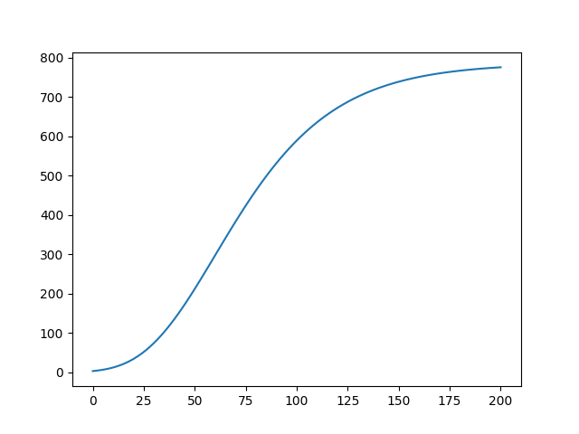
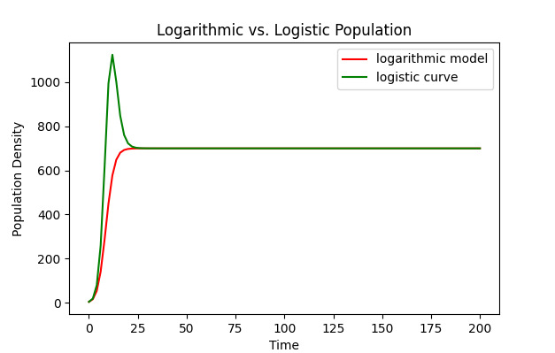
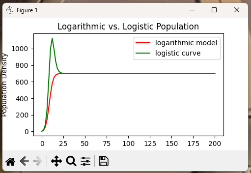
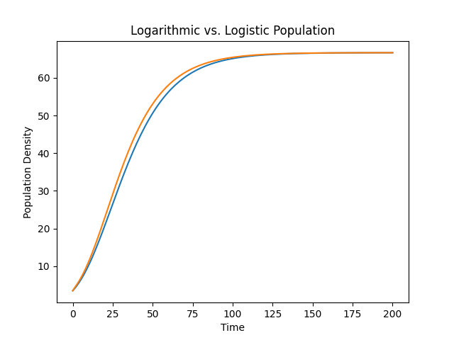

# A Small Module on Creating Graphics

It is important to be able to visualize simulation
results in many areas of engineering, science,
economics and so on. In this module we will take on
a problem with the goal of visualizing the output
from our population density models from the previous
module. In the module three separate models were
defined.

The first was the Malthusian model that resulted
in an exponential function for an exact solution.
The second model was the logistic model that results
in a rational function of exponential terms. The
third model does not have an analytic solution. So,
we need to be satisfied with an approximate solution.

In using these models, both the Logistic model and
the logarithmic model have equilibrium solutions.
The important of these are the carrying capacities
for each of the population density models. Since the
logarithmic model does not have an exact closed form
solution, the best we can do is to compare the
logarithmic model to the logistic model and compare
the behavior near the equilibrium solutions.

We will use graphical comparisons. The easiest tool
for this is to **import** the **matplotlib** packages
written for use with **python** programs.

## Some Data for the Module

In the last module we considered the approximation of
solutions of population density models. The differential
equations used were approximated by finite difference
equations when the derivative was replaed by the difference
as follows:
$$
  \frac{dP}{dt} \approx \frac{P(t+\Delta t)-P(t)}{\Delta t}
$$
This was used to develop formulas for computing the
several different approximations. Our interest was in the
logarithmic model and how the approximation compared with
the logistic model.

The finite difference equation that resulted was
$$
  P(t+\Delta t) \approx P(t) + \alpha\ P(t)
     - \gamma\ \Delta t\ P(t) ln(P(t))
$$
which suggests the discrete sequence of approximations
determined by
$$
  P_{k+1} = ( 1 + \alpha\ \Delta t ) P_k
      - \gamma\ \Delta t\ P_k\ \ln(P_k)
$$
A basic code for implementing the algorithm above can
be viewed at the following link:

[Basic Code for the Logarithmic Model](../src/logarithm.py)

This should provide a simple starting point. The output
from the code is a graph shown in the next figiure.

## Graphing One Data Set

Graphing a single data set is not too difficult. As seen
in the code in the previous section, you need only do an
import of matplotlib and add two plotting commands that
are a part of the matplotlib package.

**Note:** The graph shown is a very simple plot. There
are no labels, legends, or other identifying that could
be added to the graphical interpretation of the
simulations.

## Graphing Multiple Data Sets

Another thing we could try is to graph the approximate
solutions on the same figure. In this case,  we would
need to be careful to annotate the graphs with the
particular approximation. This means labeling the graph
and putting a **legend** in the figure for clarity.

### An Example

The commands that are needed in order to annotate the
graph are contained in the link below.

[Code to Graph Multiple Approximations](../src/carrying_test.py)

The graph generated by the code is shown in the following
figure.

The graph may need to be resized. This is an issue that
can be resolved before saving the figure. Below is a
screen capture of the window that pops up when the
code is executed. The window has a **tool bar*** at the
bottom that can be used to resize and a few other
tricks.

**Note** In the graph shown the labels of the axes are cut
off. By resizing the graph, the labels will show up again.
You can use the tool bar to increase the size of the figure
by just resizing the window.

**Note** The graph has a problem. When one looks at the
curve for the logistic model, the approximation via a
logistic model crosses the carrying capacity and then
comes back down. This is not allowed in the differential
equation. The simulation likely needs to be done with a
smaller step, $dt$.

**Note** It also appears that the logarithmic model seems
to do a better job approximating the expected behaviour
of not crossing an equilibrium solution. It would be
a good idea to compare the solutions in more cases
before continuing on.

## Animation of A Single Data Set

Under Construction

## Animation of Multiple Data Sets

Results will appear later.

## Comparison of Logistic and Logarithmic Models

This is really comparing apples and oranges in some sense.
We really cannot compare the solutions since the logarithmic
model does not have a readily available exact solution.
However, we can compare the approximate solutions in the
case when the carrying capacities are the same.

We can find the carrying capacities by looking for nonzero
equilibrium solutions for the model. These turn out to occur
when
$$
  \frac{dP}{dt} = 0
$$
We do not need to consider the zero solutions since there
really is no information that comes along with these two
cases. Zero solutions are typically associated with unstable
equilibria and for these models this is the cases.

### Graphing the Comparison

For the logistic equation the carrying capacity comes from
$$
  0=\alpha - \beta\ P \ \rightarrow\ P = \frac{\alpha}{\beta}
$$
and for the logarithmic model we will use the same idea
to create the equation
$$
  0=\alpha-\gamma\ \ln(P)\rightarrow P=e^{\frac{\alpha}{\gamma}}
$$
To obtain a match we can just set these values equal to
each other. That is,
$$
  e^{\frac{\alpha}{\gamma}} = \frac{\alpha}{\beta}
$$
We will assume the growth rate parameter, $\alpha>0$, is the
same for both models.

The assumptions give relationships between the parameters,
$\beta$ and $\gamma$ as follows.
$$
  \gamma = \frac{\alpha}{\ln(\alpha)-\ln(\beta)}
$$
and
$$
  \beta = \alpha\ e^{-\frac{\alpha}{\gamma}}
$$
If the two models have the same carrying capacity the
solutions must eventually approach the same result as
$t$, the time, gets large enough.

**Note:** It is typical to assume that $\alpha>\beta$
in the logistic model which also implies that $\gamma>0$
in the first relationship above. If there is a large
difference between $\alpha$ and $\beta$ in the logistic
model, $\gamma$, may be very small.

### One Example Using the Carrying Capacity

Let's define an example that illustrates the difference
between the logistic and logarithmic models. Set $\alpha=0.2$
and $\beta=0.003$. This implies $\gamma\approx 0.047622392$.

The graphcs of the two models are shown in the next figure.

---

## The Main Question for Math 4610 at USU

---

The main task in this module is to produce graphics
that can be used to describe what is going on with
the simulations of population density that were
developed in the previous module.

* Use Matplotlib to graph the individual approximations
  for the density models. This includes:
  * Malthus Model approximation using explicit Euler.
  * Malthus model approximation using implicit Euler.
  * Logistic model approximation using explicit Euler.
  * Logistic model approximation using implicit Euler.
  * Logarithmic model approximation using explicit Euler.
  * Logarithmic model approximation using predictor
    corrector defined in class.
* Graph the results from the logarithm and logistic
  models with the explicit schemes used for the
  approximate results.
* Graph result from the the logistic and logarithmic
  approximations where the implicit Euler method is
  used on the logistic model and the predictor
  corrector method applied to the logarithm model.

Use the following parameters. You will need to compute
$\gamma$ from $\alpha$ and $\beta$.
$$
  \alpha = 0.593, \ \ \ \ \beta = 0.001086
$$
Show your calculations.
